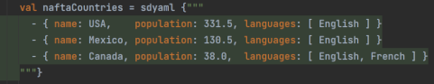
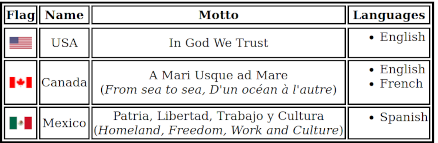

## Fun with Scala 3 Macros, `Dynamic` and Yaml

Scala is, undoubtedly, a poster child of strong typing.

Yet, honoring its scalability ethos, it is also capable of dynamicity in the _laissez-faire_ style of its most liberal
scripting cousins.

To illustrate this, we introduce `SDynamic`, a small programming divertimento leveraging Scala's dynamic abilities to:

- Write object literals as [Yaml](https://en.wikipedia.org/wiki/YAML) strings, and then,
- Treat dynamic results as if regular Scala objects

```scala
// Look ma: no intervening case classes!
val countries = sdyaml {"""
  - { name: USA,    population: 331.5, languages: [ English ] }
  - { name: Mexico, population: 130.5, languages: [ English ] }
  - { name: Canada, population: 38.0,  languages: [ English, French ] }
"""}
  .toList

// Look ma: dynamic property references!
assert(3 == countries.length)
assert("USA" == countries(0).name)
assert(130.5 == countries(1).population.toDouble)
assert(Seq("English", "French") == countries(2).languages.toList)
```

Here:

- A minimalistic subset of Yaml is used to express object graphs
- Dynamic property references are used, courtesy of Scala's
  [`Dynamic`](https://scala-lang.org/api/3.x/scala/Dynamic.html) trait
- The `sdyaml` macro validates Yaml and populates a dynamic object graph at compile time

👉 IntelliJ Idea users get the added bonus of Yaml syntax highlighting via language injection:



In a small way, `SDynamic` relates to a prehistoric request shamelessly formulated in 2008:
[SI-993: Add support for YAML (like XML)](https://issues.scala-lang.org/browse/SI-993).

Since then, in-language XML literals have long been obliterated. No hope for Yaml, whatsoever 😒

Today, we stubbornly continue to carry this flag to celebrate, tongue-in-cheek, this interesting dynamic corner of the
language.

## Why on Earth?

Yeah, why? And what about type-safety? 🤨

Like many such small utilities, `SDynamic` was born of a personal itch to scratch: I needed to write numerous unit tests
requiring lots of structured (but otherwise *volatile*) data.

Creating case classes, nesting other case classes and then writing looong object literal expressions for them quickly
grew tedious and cumbersome:

```scala
case class Country(name: String, currency: String, population: Double,
                   motto: String, languages: Seq[String])

// Wrappers, parens, quotes, commas. Oh my!
val countries = Seq(
  Country(
    name = "USA", currency = "UDS", population = 331.5,
    motto = "In God We Trust", languages = Seq("English")),
  Country(
    name = "Canada", currency = "CAD", population = 38.0,
    motto = "A Mari Usque ad Mare", languages = Seq("English", "French")),
  Country(
    name = "Mexico", currency = "MXN", population = 130.5,
    motto = "Patria, Libertad, Trabajo y Cultura", languages = Seq("Spanish"))
)
```

☝️ The astute reader will notice the above could be written sàns named parameters. For nested structures with more than
just a few fields, however, positional parameters quickly obscure value-to-field attribution.

When dealing with one-off object literals we want:

- Minimal verbosity
- Maximal readability

As for type-safety in this context:

> Roads? Where we're going we don't need roads
>
> 
> -- Dr. Emmet Brown

## Why Yaml?

Yeah! Why not JSON? Or XML?

Well, Yaml arguably has the tersest and most readable object literal syntax in town ([vilification](https://noyaml.com)
of some of its non-syntactic features notwithstanding 😛).

Let's see:

<table>
  <tr>
    <th>Language</th>
    <th>Example</th>
  </tr>
  <tr>
    <td><b>Yaml</b><br>(Mkay)</td>
    <td><pre><code>- { name: USA,    population: 331.5, languages: [ English ] }
- { name: Mexico, population: 130.5, languages: [ English ] }
- { name: Canada, population: 38.0,  languages: [ English, French ] }</code></pre></td>
  </tr>
  <tr>
    <td><b>JSON</b><br>(Uff!)</td>
    <td><pre><code>[{"name": "USA",    "currency": "USD", "population": 331.5, "languages": [ "English" ] },
 {"name": "Canada", "currency": "CAD", "population": 38.0,  "languages": [ "English", "French" ] },
 {"name": "Mexico", "currency": "MXN", "population": 1305,  "languages": [ "Spanish" ] }]</code></pre></td>
  </tr>
  <tr>
    <td><b>XML</b><br>(Ugh!)</td>
    <td><pre><code>&lt;countries&gt;
  &lt;country&gt;
    &lt;name&gt;USA&lt;/name&gt;
    &lt;currency&gt;USD&lt;/currency&gt;
    &lt;population&gt;331.5&lt;/population&gt;
    &lt;languages&gt;
      &lt;language&gt;English&lt;/language&gt;
    &lt;/languages&gt;
  &lt;/country&gt;
  &lt;country&gt;
    &lt;name&gt;Canada&lt;/name&gt;
    &lt;currency&gt;CAD&lt;/currency&gt;
    &lt;population&gt;38.0&lt;/population&gt;
    &lt;languages&gt;
      &lt;language&gt;English&lt;/language&gt;
      &lt;language&gt;French&lt;/language&gt;
    &lt;/languages&gt;
  &lt;/country&gt;
  &lt;country&gt;
    &lt;name&gt;Mexico&lt;/name&gt;
    &lt;currency&gt;MXN&lt;/currency&gt;
    &lt;population&gt;1305&lt;/population&gt;
    &lt;languages&gt;
      &lt;language&gt;Spanish&lt;/language&gt;
    &lt;/languages&gt;
  &lt;/country&gt;
&lt;/countries&gt;</code></pre></td>
  </tr>
</table>

Yaml minimizes punctuation while enhancing readability:

- No need to enclose property values or (the horror!) *property names* in quotation marks
- No need to separate list elements with commas or enclosing lists in brackets when using multi-line mode
- No need to verbosely mark the beginning and end of each property

# Example

The example below builds the following HTML content:



```scala
import plenix.sdynamic.sdyaml

object Example:
  def main(args: Array[String]): Unit =
    
    val countries = sdyaml {
      """
        |- name: USA
        |  currency: USD
        |  population: 331.5
        |  motto: In God We Trust
        |  languages: [ English ]
        |  flag: usa.webp
        |- name: Canada
        |  currency: CAD
        |  population: 38.0
        |  motto: A Mari Usque ad Mare<br> (<i>From sea to sea, D'un océan à l'autre</i>)
        |  languages: [ English, French ]
        |  flag: canada.webp
        |- name: Mexico
        |  currency: MXN
        |  population: 1305
        |  motto: Patria, Libertad, Trabajo y Cultura<br> (<i>Homeland, Freedom, Work and Culture</i>)
        |  languages: [ Spanish ] 
        |  flag: mexico.webp
        |""".stripMargin
    }
      .toList
    
    def country2Html(country: SDynamic) =
      s"""
         |<tr>
         |  <td></td>
         |  <td>${country.name}</td>
         |  <td>${country.motto}</td>
         |  <td>
         |    <ul>
         |      ${country.languages.toList.map(language => s"<li>$language</li>").mkString}
         |    </ul>
         |  </td>
         |</tr>
         |""".stripMargin
    
    val pageHtml =
      s"""
         |<html>
         |  <head>
         |    <meta charset="UTF-8">
         |    <title>NAFTA Countries</title>
         |    <style>
         |      table { margin-left: auto; margin-right: auto; border-style: solid; }
         |      th { border: 2px solid;}
         |      td { border: 2px solid; text-align: center; vertical-align: middle; }
         |      ul { text-align: left; }
         |  </style>
         |  </head>
         |    <body>
         |      <table>
         |      <tr>
         |        <th>Flag</th>
         |        <th>Name</th>
         |        <th>Motto</th>
         |        <th>Languages</th>
         |      </tr>
         |      <tr>${countries.map(country2Html).mkString}</tr>
         |    </table>
         |  </body>
         |</html>
         |""".stripMargin
    
    val out = new java.io.FileWriter("countries.html")
    try
      out.write(pageHtml)
    finally
      out.flush()
      out.close()
```

